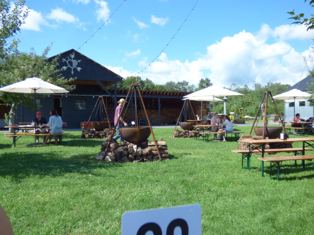

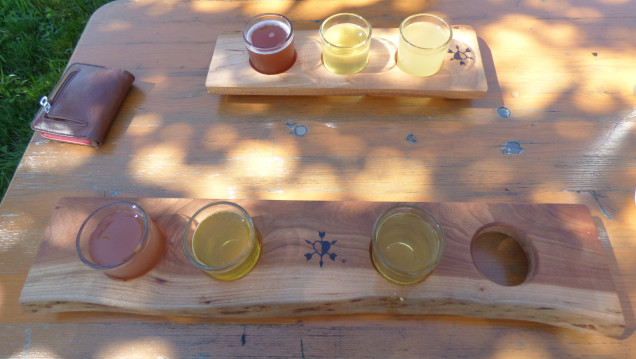

Nothing says fall in New York like apples. A few weekends ago, our family went on an apple adventure in the Hudson Valley region of New York. Our first stop was at [Westwind Orchard](https://scoutupstate.com/guide/attraction/westwind-orchard). The orchard didn’t produce enough apples this year for u-pick, but there is a nice area for hanging out, along with a small restaurant serving Italian tapas and wood-fired pizza, a variety of hard ciders, and a small store selling locally made goods and foods.

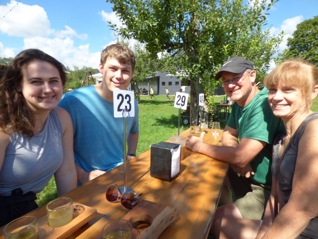

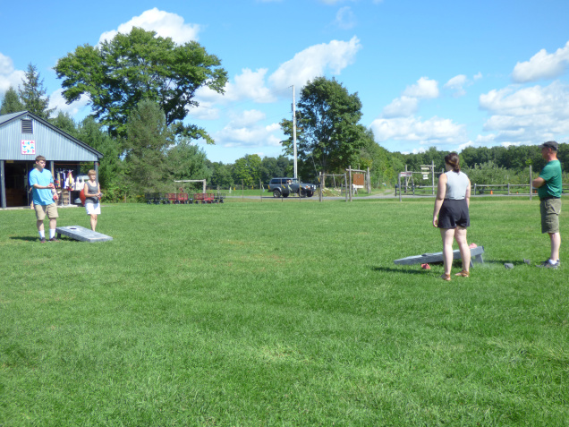

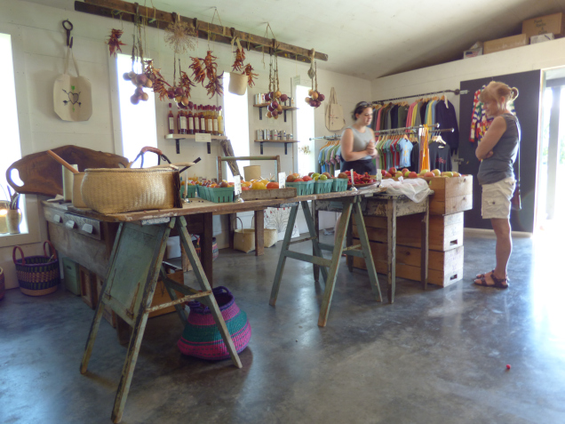

My sister and I ordered a flight of hard cider to try and we all got some pizzas to share. There are a bunch of tables outside and we played some cornhole while waiting for our food. There were lots of families enjoying the beautiful weather and gorgeous location.

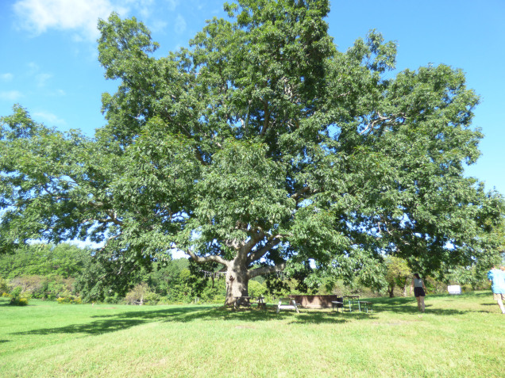

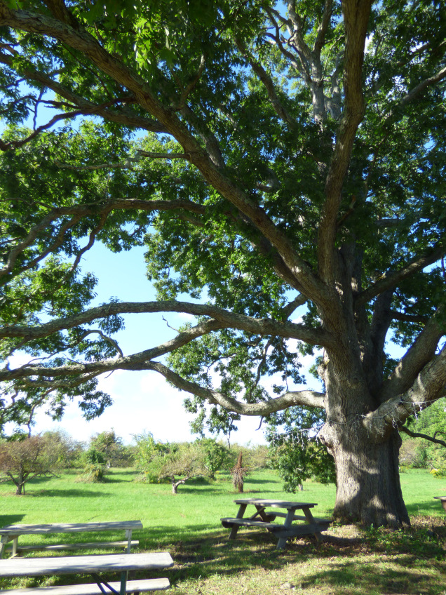

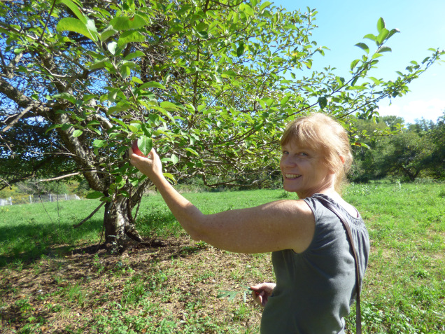

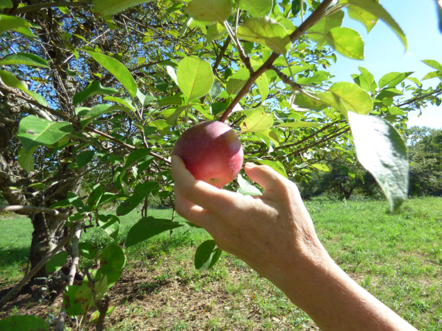

After eating our fill, we headed down the road to a small U-pick orchard. [Stone Ridge Orchard](https://scoutupstate.com/guide/attraction/stone-ridge-orchard) is a traditional apple orchard. The apple trees are 200-plus years old and the orchard doesn’t have the commercial feel typical of many U-pick orchards in New York. There were no lines and the employees were incredibly friendly and helpful. We explored the orchard after a long conversation with one of the employees. In addition to plenty of apple trees, we were encouraged to walk up the short hill to see the 300-year-old white oak tree. The tree is massive and absolutely stunning.

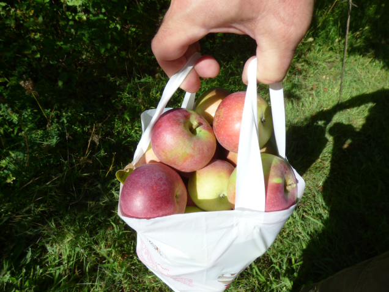

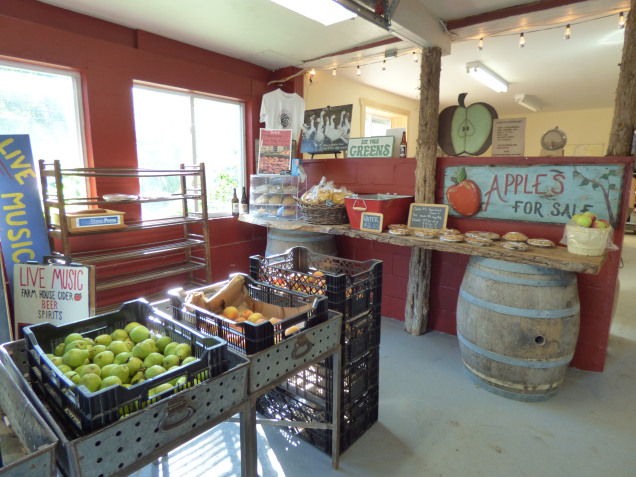

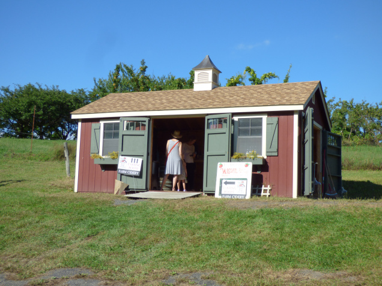

We picked a bag of apples, then bought some apple cider and donuts. Before heading out, we sampled some of the hard cider made with apples from the orchard.

By then, it was late afternoon, so we headed home. It was a perfect outing on a beautiful day!

