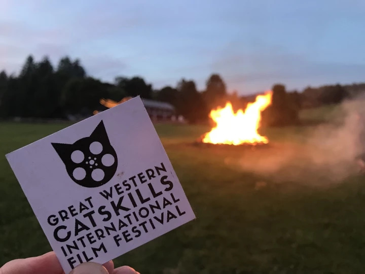

A new film festival is coming to the Catskills this fall, October 19th through 21st. From their [website](https://www.gwciff.com/):

> The first ever Great Western Catskills International Film Festival will be held in town of Andes, New York for one weekend this fall. Come and experience the best in independent film from all over the world in this beautiful mountain setting. Screening times will be announced as the films are chosen for the festival.

Single day passes range from 18 to 25 dollars depending on the day, and a three day all-access pass costs 50 dollars. These are available on their website, where you can also find recommendations for lodging and other attractions in the area.

The [Great Western International Film Festival](https://www.gwciff.com/) joins several other Catskills-area film festivals that took place already in September, including [StudioFest](https://studiofestofficial.com/) in Phoenicia,  [Catskill International Film Festival](https://www.catskillinternationalfilmfestival.com/) in Callicoon, and the [Big-Eddy Film Festival](http://www.bigeddyfilmfest.com/) in Narrowsburg.