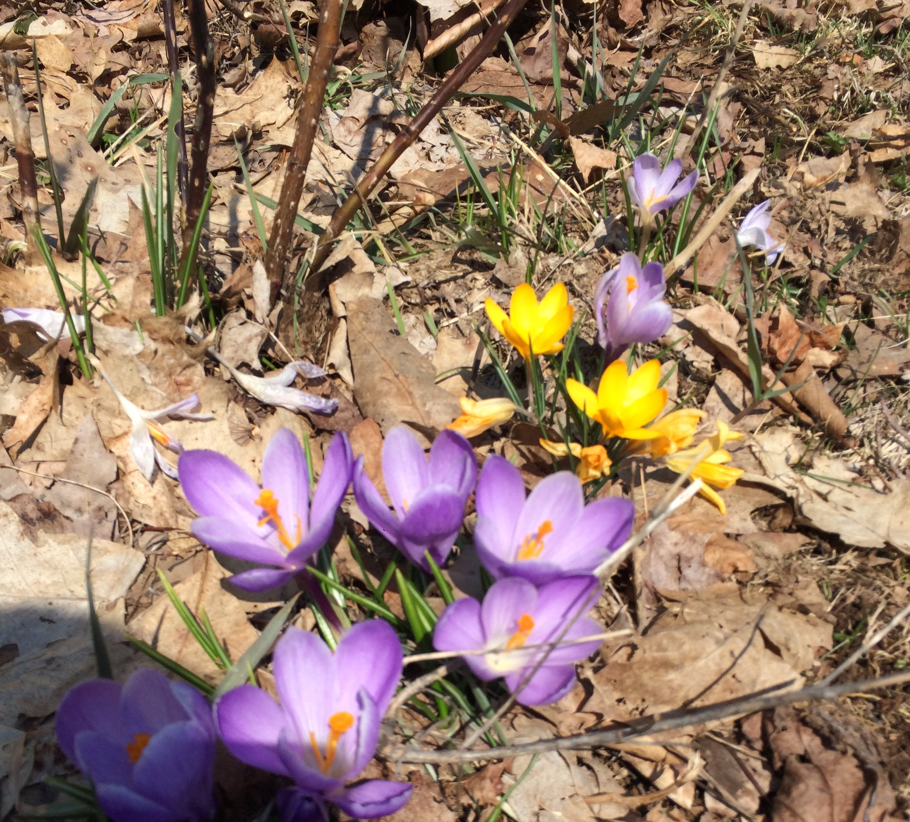

Hello from the Catskills, where we're currently experiencing a mix of snow and rain. But the crocuses were in bloom over the past few days, and that'll bring a smile to any face.

There was no newsletter last week (instead I spent some time working on an upcoming revamp of the Scout Upstate calendar page). But this week's should more than make up for it.

## For the Bookworms and Naturalists

The Overlook Press released [The Quarry Fox](http://www.overlookpress.com/upcoming/quarry-fox-and-other-critters-of-the-wild-catskills.html), a new book by Leslie T. Sharpe, former Vice President of the New York City Audubon Society and a lifelong naturalist living on Lazy Hawk Mountain in the Great Western Catskills.

From the publisher's description:

“A red fox stands poised at the edge of a woodchuck den, his ears perked for danger as two pudgy fox cubs frolic nearby. A mother black bear and her cubs hibernate beneath a felled tree. A barred owl snags a hapless cottontail from a meadow with its precise talons. In *The Quarry Fox*, Leslie T. Sharpe trains her keen eye and narrative gifts on these and other New York wildlife through her tales of close observations as a naturalist living in the Great Western Catskills. *The Quarry Fox* is the first in-depth study of Catskill wildlife since John Burroughs invented the genre of nature-writing, in which Sharpe weaves her experiences with the seasons, plants, and creatures with the natural history of each organism, revealing their sensitivity to and resilience against the splendor and cruelty of Nature.”

See if you can find it in your local book store first, but if not, it's available from [Amazon](https://www.amazon.com/Quarry-Fox-Other-Critters-Catskills/dp/1468312472) as well.

## Earth Day at John Burroughs Woodchuck Lodge

Learn how to get started in birding from veteran birder Joe Siclare at an event to raise funds for the pruning of the apple orchard at the John Burroughs center. $30 per family, first 20 to register will take home a locally made bluebird nesting box. J.N. Urbanski of [Upstate Dispatch has the details](http://upstatedispatch.com/2018/04/earth-day-at-john-burroughs-woodchuck-lodge/).

While we're mentioning Upstate Dispatch, you might also enjoy his post on [beekeeping](http://upstatedispatch.com/2018/01/bee-hopeful/), which was the first I'd heard of Anarchy Apiaries, a non-profit in Livingston Manor. [Anarchy Apiaries](http://anarchyapiaries.org/hivetools/) is “dedicated to promoting bees and beekeeping whose mission is to 'make more beehives than televisions' and 'distribution of mite-and-disease-tolerant, cold-hardy mated queen bees, facilitating Beekeeping Bootcamp hands-on trainings, setting up every 7-year-old with their own bee hive, reinvigorating our own NY bee club- the B. A. N. D. (Beekeepers Association of Northern Dutchess), the New Bee Circus travelling bee medicine/training/puppet show, and modifying our bee-hauling van to run on waste vegetable oil'.”

## Feral to Fruiting / An Apple Tree Rejuvenation Workshop

Tomorrow at the Thorn Preserve in Woodstock. The following [description from the Castskill Center website](http://catskillcenter.org/events/2018/4/18/apple-tree-rejuvenation-workshop) (with form to RSVP):

> The good people at [Abandoned Cider](https://www.facebook.com/Abandonedcider/) press tasty cider from the fruit of abandoned orchards.
>
> Our beautiful Thorn Preserve is littered with apple trees that have not been pruned in many, many years and Abandoned Cider is coming to help repair the situation and teach us how to keep our apples in healthy fruit-producing shape.
>
> April 18, from 1 PM until 6 PM, learn to rejuvenate a neglected apple tree.
>
> If you have pole saws, hand saws, pruners +/or orchard ladders and would like to bring them along, we say, "please do!"

## Other Events

🎣 🎭 🎨

* [Headwaters Hike on the Wilowemoc](http://catskillstrouttales.com/event/headwaters-hike-on-the-wilowemoc/) - April 20 @ 2:00 pm - 8:00 pm, Claryville
* [A Mythic Catskills Weekend](http://catskillstrouttales.com/event/spillian-mythic-catskills-weekend/) - April 20 @ 5:00 pm - April 22 @ 5:00 pm, Spillian in Fleischmanns
* [Something Fishy on Main](http://catskillstrouttales.com/event/margaretville-something-fishy-main/) - April 21 @ 10:00 am - 4:00 pm, Margaretville
* [IF4 - International Fly Fishing Film Festival®](http://catskillstrouttales.com/event/phoenicia-playhouse-if4-international-fly-fishing-film-festival/) - April 21 @ 7:00 pm - 9:00 pm, Phoenicia Playhouse
* [Trout Unlimited Meeting with Heidi Nute](http://catskillstrouttales.com/event/boiceville-inn-trout-unlimited-meeting-with-heidi-nute/) - April 25 @ 7:00 pm - 9:00 pm, Boiceville Inn
* [Reading of The Ashokan Way](http://catskillstrouttales.com/event/catskill-interpretive-center-reading-ashokan-way/) - April 26 @ 6:30 pm - 8:00 pm, Catskill Interpretive Center, Mount Tremper
* [The Fabulous Flo Hayle in ENCORES!](http://www.watershedpost.com/calendar/2018/encores) - April 21 @ 2:00 pm to 3:30 pm, Bridge Street Theatre, Catskills
* [Agnes Varda's "Faces Places"](http://www.watershedpost.com/calendar/2018/agnes-vardas-faces-places) - April 24 and 25 @ 7:15 pm, Rosendale Theatre
* [Fantastic Woman](http://www.watershedpost.com/calendar/2018/fantastic-woman) - April 27 @ 7:15 pm, Rosendale Theatre
* [Artists' Reception for Longyear Group Show](http://www.longyeargallery.org/index.html) - April 21 @ 3:00 pm to 6:00pm, Longyear Gallery, Margaretville
* [Oklahoma!](https://tockify.com/greatwesterncatskills/detail/1609/1524160800000) - April 19 @ 2:00 pm to 3:30 pm, Deposit Theatre
* [The Village Entertainment Knockerball Tournament](https://www.facebook.com/events/576828019343662/) - April 21 @ 9:00 am to 7:00 pm, Delhi American Legion
* [The Catskill Tanneries: An Environmental Disaster with a Happy Ending](http://www.dailyfreeman.com/article/DF/20180412/NEWS/180419874) - April 19 @ 7:00 pm to 8:30pm, Boughton Place, Highland

## In the News

* **[Governor Announces Groundbreaking of Frontier Town Campground and Paradox Brewery](https://esd.ny.gov/esd-media-center/press-releases/governor-cuomo-announces-groundbreaking-frontier-town-campground-and)** - $25 Million Public/Private Investments Committed To-Date Will Establish 'Gateway to the Adirondacks' Tourism Hub; Revitalization of Former Theme Park Will Bolster Local Economy and Link Recreational Opportunities in the Adirondacks
* **[Food Boom in the Catskills](http://timberlandproperties.net/blog/food-boom-in-the-catskills/)** - “In the Catskills, direct access to some of the most exceptional produce, meat and products as well as great available spaces and better affordability make more sense for opening a new business.”
* **[Cypress Creek moves ahead with plans for Catskill’s first commercial solar farm](https://www.hudsonvalley360.com/article/cypress-creek-moves-ahead-plans-catskill%E2%80%99s-first-commercial-solar-farm?wallit_nosession=1)** - “Cypress Creek Renewables, a solar company with proposals in Cairo, Greenville and Coxsackie, is going ahead with plans to buy 60 acres at 1180 Bogart Road in Palenville to build a 2-megawatt commercial solar farm. If built, it would be the first solar farm in the town of Catskill, Planning Board Chairman Joseph Izzo said.”

Hope you'll get out and about in Upstate New York this weekend and have a great time!

P.S. You can sign up for the [Scout Upstate Newsletter](http://eepurl.com/donZ2f) here and receive it by email every week.
