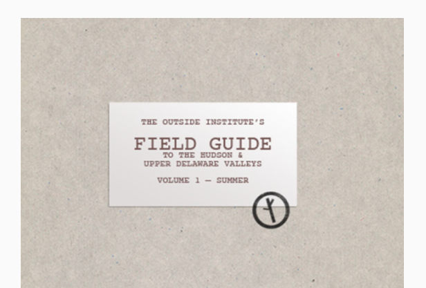
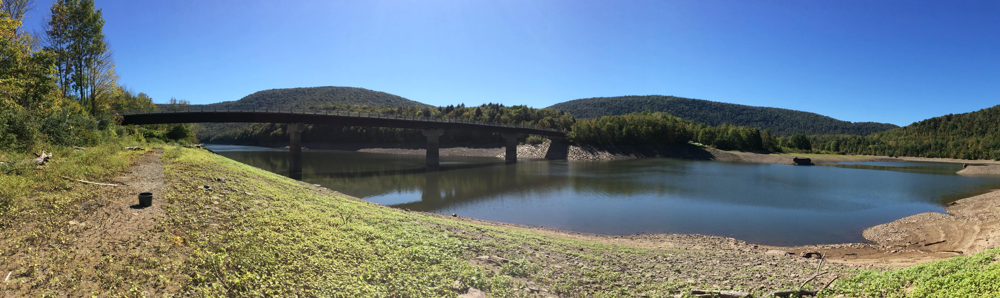

Hello from Upstate New York! It's 86 degrees and sunny here as I write this, and while there's some chance of clouds later in the week, the rain coming Thursday and Friday should be past by the weekend. I haven't included any events this week because I'm a bit out of time, but there are plenty of things happening and you can find them with a quick search. So get out there and have some fun around the Catskills this weekend!

## The Outside Institute's Field Guide to the Hudson & Upper Delaware Valleys

The Outside Institute has announced the upcoming publication of the first volume of their 3-volume Field Guide.

> Our Field Guide is intended as a point of entry for beginning naturalists, an accessible introduction to more than 50 of the most prevalent flora, fauna and fungi in the region. It includes detailed illustrations, clear descriptions for identification and usage, and even some recipes.

If you'd like a copy you can [preorder now](https://theoutsideinstitute.org/shop/the-outside-institutes-field-guide-to-the-hudson-upper-delaware-valleys) for a delivery around July 1st. 128 pages; $25 per copy.

## A Guide to Paddling on NYC Reservoirs

Want to kayak or canoe on a NYC reservoir (such as the Cannonsville Reservoir, pictured above) this summer? You'll need a free DEP access permit. This [guide](https://medium.com/nycwater/a-guide-to-paddling-on-nyc-reservoirs-b9528fc2d387) provides more information. And be sure to review the [recreational rules listed here](http://www.nyc.gov/html/dep/pdf/recrules/recrules.pdf). Kayaking is a lot of fun, and easy to learn, so don't be daunted if you've never gone before.

That's all for this week. Hope you have a great weekend!

—The Scout Upstate team
